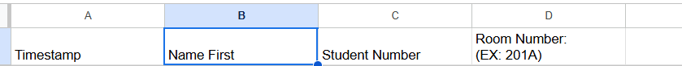

# Resident Sign-Up Checker

## Overview

If any help is needed setting up or fixing, contact Tommy Juricek, thomasjjuricek@lewisu.edu

The Resident Sign-Up Checker is a simple Python script that helps you compare a base resident roster with a sign-up form, for meetings. It identifies:

- **Residents who did not sign up**.
- **Residents who signed up outside of a specified time frame**.
- **Sign-ups that don't match anyone on the base roster**.

## How to Use

1. **Run the Script:**
  - To run the script, you will need either:
  1. Python installed. If you have python, you can just run this in a ISE, or in your terminal.
  2. A premade EXE. Attached is one for windows, so if you have windows, you should just be able to download and run it. The .exe is saved at https://lewisu0-my.sharepoint.com/:u:/g/personal/tjuricek1_lewisu_edu/EeZq9Ly4Nz5HmFaWxeXlZ0IB7oSny_YhVuYa4thDvzTCkA

## Google Form Setup

- All you need is a default google form, with 2 NEEDED prompts:
1. Users Full Name
2. Users Full ID number

Here is a example form: https://docs.google.com/forms/d/e/1FAIpQLScVeAWDWFhXykDEG-p5xkiRCQyAL6C7BeaX1NwJcoPSPi7vSw/viewform?usp=sharing

When creating a form, check in the google sheets that it links to, and make sure these fields are named correctly:

Students name should be : "Name First"
ID Number should be be: "Student Number"


This is just so the program reads the correct column.
Now, you can export this when the meeting is over, and compare it to the roster.
(Ensure the roster file only contains your dorm)

  Python installed, or you can run the executable, that will only work on windows.

2. **Follow the Prompts:**
   - Enter the path to your base roster Excel file when prompted.
   - Enter the path to your sign-up form Excel file when prompted.
   - Enter the timeframe of the meeting/the time that a signup will be considered "Valid". The program automaticly assumes PM.
   - The script will run.
   - Enter the path and filename where you want to save the results (e.g., `C:\path\to\output.xlsx`).

3. **View the Results:**
   - The script will display a summary of residents who didn’t sign up or signed up outside of the allowed time.
   - It will also highlight any sign-ups that are not on the base roster.
   - The detailed results will be saved in an Excel file at the location you specified.

## Example

```plaintext
Enter the path to the base roster file (spreadsheet 1): C:\Users\YourName\Documents\ResidentRoster.xlsx
Enter the path to the sign-up form file (spreadsheet 2): C:\Users\YourName\Documents\SignUpForm.xlsx
Enter the start time (e.g., 8:00): 7:00
Enter the end time (e.g., 9:00): 11:00
Enter the path to save the results (including the filename, e.g., C:\path\to\output.xlsx): C:\Users\YourName\Documents\Results.xlsx
